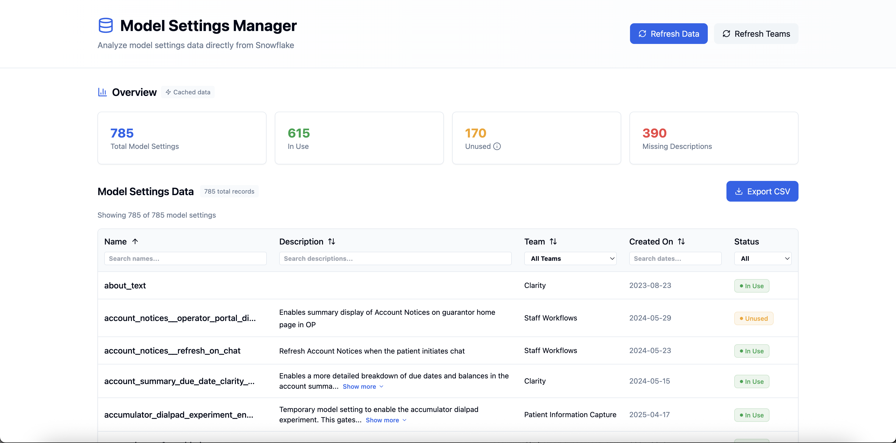

# Model Settings Helper

A tool to manage and view Django model settings with team ownership information.

## Quick Start

First, _make sure you're connected to Tailscale_ as you have to be able to query Snowflake!

1. **Setup (in the root directory of this repo)**
   ```bash
   brew install snowflake-cli && npm i
   ```

2. **Start the server:**
   ```bash
   npm run dev
   ```

3. **Open the app:**
   ```bash
   open localhost:5173
   ```

**Debugging if something goes wrong:**
1. Make sure you're connected to Tailscale
2. Try running the app with `USER=[your Snowflake user, ex awerner] npm run dev`

## Requirements

- Node.js 18+
- Snowflake CLI installed and configured
- Access to the Cedar codebase (for team mapping)

## How it works

1. **Data Source**: Queries Snowflake directly using your existing authentication
2. **Team Mapping**: Scans the Cedar codebase and `CODE_OWNERSHIP.yml` to determine team ownership
3. **Usage Detection**: Analyzes Snowflake data to determine if settings are in use

## Development

The server runs on port 3001 and uses:
- Express.js for the API
- Snowflake CLI for database queries  
- Direct file system access for team mapping
